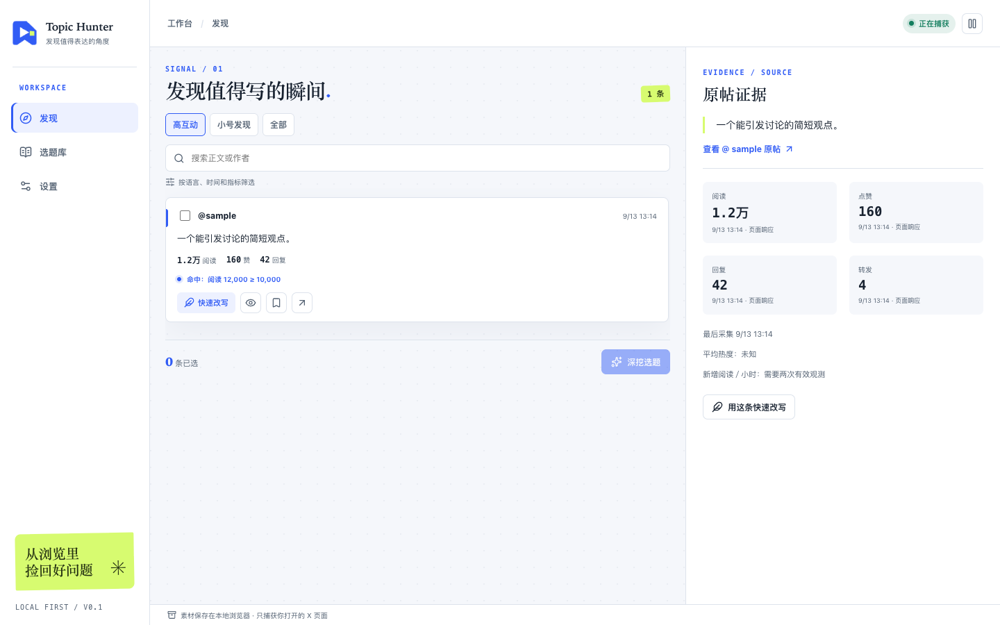

<p align="center"></p>

<p align="center">从已读的 X 内容里，找到你的下一个表达角度。<br>Find the signal. Write your angle.</p>

<p align="center">
  <a href="https://github.com/WaterDJiang/topic-hunter/actions/workflows/ci.yml"></a>
  <a href="LICENSE"></a>
  <a href="CHANGELOG.md"></a>
</p>

Topic Hunter 是开源 Chrome 插件。它在你**正常浏览已打开的 X 页面**时，记录已加载帖子及可见互动指标，帮你从短内容中发现可写的素材。它不后台巡视未打开的帖子，也不自动滚动或追加 X 数据请求。



> **当前为 0.1.0 开发预览。** 已用虚构 X 响应验证构建、采集、侧栏与素材库流程；五类真实 X 页面、真实 AI 服务和选题效果仍待验收。源码公开不等于 Chrome Web Store 正式发行。

## 两条创作路径

- **快速改写：** 单条素材 → 写自己的判断或按需让 AI 起草 → 编辑 → 只复制稿件正文。你自行到 X 粘贴发布；快速稿不自动进入选题库。
- **深挖选题：** 选择 1–10 条素材 → 生成有原帖引用的短推角度和长文选题 → 核实、编辑、整理状态。没有 AI 接口也能复制提示词继续。

候选规则默认按短内容长度、时间、阅读和互动阈值判断；缺失指标显示“未知”。同帖重复遇到时保留新观测。素材和草稿默认只存本机，AI 只在点击生成后向你配置并授权的 HTTPS 接口发送所选内容。详细边界见[产品规格](specs/2026-09-13-topic-hunter-v1.md)和[隐私说明](PRIVACY.md)。

## 从源码安装

需要 Chrome 桌面版、Node.js 22+、pnpm 10.29.3。

```bash
git clone https://github.com/WaterDJiang/topic-hunter.git
cd topic-hunter
pnpm install --frozen-lockfile
pnpm build
```

打开 `chrome://extensions`，开启开发者模式，点击“加载已解压的扩展程序”，选择 `.output/chrome-mv3`。点击扩展图标打开侧栏，再浏览 `x.com`。设置页可暂停采集、调整阈值、配置可选的 Chat Completions 接口和导出本地数据。

`pnpm zip` 会在 `.output/` 生成 ZIP；ZIP 是构建产物，Chrome 开发者模式请加载上面的解压目录。目前没有正式商店安装链接。

## 开发与版本

```bash
pnpm typecheck
pnpm lint
pnpm test
pnpm test:e2e
pnpm build
pnpm zip
python3 scripts/check_docs.py
```

`pnpm test:e2e` 先构建，再用 Chromium 加载扩展；测试数据是虚构帖子。改动 UI 或采集代码时须运行该命令。版本与尚未验收项见[更新记录](CHANGELOG.md)和[阶段计划](doc/plan/2026-09-13-m0-m4-roadmap.md)。

## 项目资料

- [规格与验收](specs/INDEX.md) · [架构与 UI](doc/design/INDEX.md) · [开源调研](doc/ref/INDEX.md)
- [品牌资产](brand/README.md) · [贡献说明](CONTRIBUTING.md) · [隐私说明](PRIVACY.md) · [安全报告](SECURITY.md)
- [MIT 许可证](LICENSE) · [项目 Agent 约定](AGENTS.md)

Topic Hunter 与 X 无关联。没有复制所调研项目的源码；未来引入第三方代码时按[来源记录](doc/ref/2026-09-13-open-source-landscape.md)复核授权。
