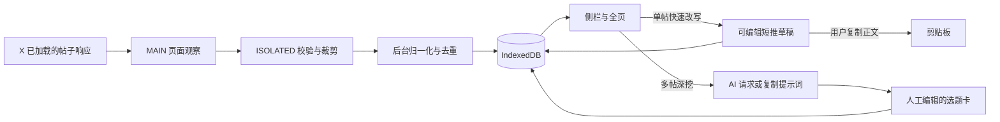

# 扩展架构与数据契约

- 状态：有效设计，实施中；本地构建已通过，真实 X 与 AI 接口仍待验。
- 依据：[v1 规格](../../specs/2026-09-13-topic-hunter-v1.md)与[开源调研](../ref/2026-09-13-open-source-landscape.md)。
- 技术选择：Manifest V3、WXT 0.21.4、React 19.3.0、TypeScript 5.9.3、pnpm；CSS Modules＋共享 Token；`idb` 8.0.3 封装 IndexedDB，TanStack Virtual 3.14.12 虚拟化素材列表，`chrome.storage.local` 保存设置。精确依赖以根目录锁文件为准。

## 数据流与边界

- **MAIN**：在 `document_start` 观察 X 已发出的帖子响应，只向桥接层传帖子 ID、正文、作者公开信息、时间与公开指标。不得传 Cookie、Authorization、CSRF、请求头或完整响应体；不得修改 X 的请求、响应及编辑器。
- **ISOLATED**：校验消息来源、字段类型、大小与允许的页面地址，拒绝未知消息；只允许白名单字段进入扩展消息。
- **后台**：负责解析版本适配、标准化、候选标记、去重与持久化。跨标签同一帖子按 ID 合并；计数回落也留观测，不伪造单调增长。业务数据不能只存在 Service Worker 内存。
- **扩展页面**：侧栏与全页通过共享查询/命令接口读取数据。单帖可直接编辑或显式请求 AI 改写，多帖可显式请求 AI 选题；无 API 时两种任务各有专用提示词。关闭页面时取消当前请求并保留输入；恢复时显示“上次生成已中断”，不自动重试收费请求。复制快速稿只访问剪贴板，用户自行到 X 粘贴发布。
- **设置访问**：Chrome 的 `storage.local` 默认可被内容脚本访问。初始化时调用 `chrome.storage.local.setAccessLevel({ accessLevel: 'TRUSTED_CONTEXTS' })`，让密钥与创作定位只在后台和扩展页面可读；内容脚本需要的开关状态通过限定字段的后台消息获得。[官方依据](https://developer.chrome.com/docs/extensions/reference/api/storage)

## 最小领域对象

| 类型 | 必要字段及约束 |
|---|---|
| `Post` | `id`、`url`、`text`、`authorId`、`authorHandle`、`publishedAt?`、`capturedAt`、`isComplete`、`quotedPostId?`、`saved`、`lastSeenAt`；缺失字段为 `null`，不以 0 代替 |
| `MetricObservation` | `postId`、`observedAt`、`source`、`views?`、`likes?`、`replies?`、`reposts?`、`bookmarks?`、`followers?`；按帖子与时间追加，不覆盖历史 |
| `CaptureRule` | `id`、`enabled`、长度/时间范围、阅读/互动阈值及逻辑关系；预设可编辑、可恢复默认 |
| `QuickDraft` | `id`、`sourcePostId`、`text`、可选个人观点/例子、创建/修改时间；独立于选题卡，本地恢复、手动删除，复制时只取 `text` |
| `TopicCard` | `id`、`sourcePostIds`、观察、短推角度、长文选题、待核实项、状态、创建/修改时间；编辑后不由源数据刷新覆盖 |
| `CreatorProfile` | 可选的领域、读者、语言、已有观点；默认输出中文 |
| `AIConfig` | 模式、接口地址、模型、密钥；密钥不进入素材库、导出、页面消息或日志 |

`Post` 只表示原帖文本，引用内容存独立帖子或关联摘要；不能拼入原帖正文后重新计算长度。超过 280 可见字符或正文不完整的帖子不进入“短内容”自动候选，但可手动保存。

## 指标规则

- 平均热度＝累计阅读量／发布至观测时间的小时数，发布时间缺失或分母不正时显示未知。
- 观测增长＝两次有效观测的阅读差／观测间隔小时数；差为负时标为“计数回落”，不显示负增长或截为 0；观测区间在 UI 可见。
- 候选判断使用配置阈值与原始指标，不用 AI 判定、不生成单一爆款总分。缺失数值不参与相应比较。
- 语言、作者、页面类型和观测来源作为过滤/溯源元数据，不得凭空补齐。

## 存储、权限与导出

- 本地 IndexedDB 建 `posts`、`observations`、`quickDrafts`、`topicCards` 存储区，以帖子 ID 为主键；新观测写入与帖子更新使用同一事务。当前数据库 schema 版本为 1，升级时需补迁移测试。
- 自动候选无收藏、快速稿或选题引用且 30 天未再命中时清理；已收藏或被创作产物引用的素材保留，手动删除由用户执行。
- 本地清理由 `chrome.alarms` 每日触发；后台 Worker 唤醒后从存储恢复状态，不依赖常驻内存。
- 仅对 `x.com` 页面申请采集权限。自定义 AI 地址须是 HTTPS，先向用户说明目标主机和将发送的字段，授权后按需请求；权限拒绝时提供复制提示词。不得把密钥暴露给 X 页面。
- 当前 API 协议为兼容 OpenAI Chat Completions 的 JSON 请求与 `choices[0].message.content` 文本响应；不同供应商的兼容性需要逐个验证。快速稿与选题由扩展页面直接请求，支持 AbortController 取消。
- 备份 JSON 含 `schemaVersion`、导出时间、素材、观测、快速稿和选题，不含 `AIConfig` 密钥。导入先校验版本与字段，按 ID 去重、合并观测，不覆盖用户已编辑的稿件或选题。选题 Markdown 导出含原帖 URL 与生成/修改时间；快速稿不混入选题 Markdown。

## 组件职责与变更

WXT 入口按页面观察、后台、侧栏、全页分开；纯解析/规则/提示词逻辑不依赖 React；共享显示组件只接收已标准化数据。快速改写与深挖选题可共用 API 请求、取消和来源呈现，提示词及产物模型分开。组件抽离以职责和复用为准，重复或行数阈值只触发评审。改共享组件时检查侧栏、素材库、快速稿和选题库调用方，并按 [UI 验收](2026-09-13-ui-experience.md)回归。
